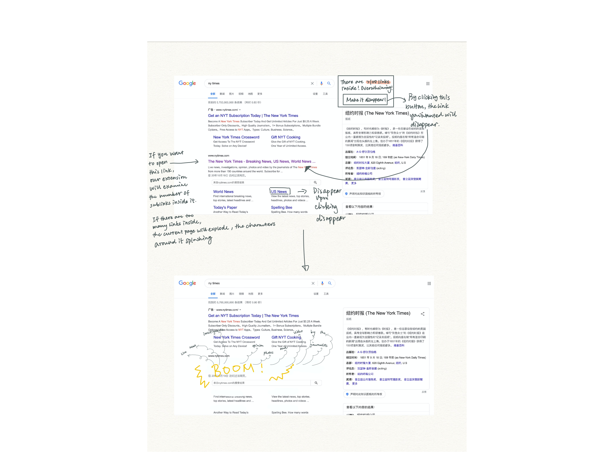

# Project B Proposal

In a digital and information era, we are dealing with far more data than ever before. On the one hand, we have more resources and references to solve our problems, but have you ever thought that there are too much information on the Internet? Have you felt overwhelmed by choosing the actually useful information yourself? Is there ever a moment you feel that all the links on the web are leading to content that you do not really care? Yet, those links tempts you to click into them, and a lot of information just invade into your mind. Is there ever a moment that you do not want to get exposed to so much information, and just want to browser the website without extra information? Our browser extension aims at this topic.  

This extension will examine the number of links on the website you want to open, and will show the number to you on a little window. If the links on the website is too many, you will see an explosion before you open this website, with all the characters and words splashing out in different directions. For example, when you want to visit a link which has over 50 links in it, the extension will show you that there are too many further links in this link and an explosion effect will be triggered and you won’t be able to get into the page, meaning that the link is paralyzed by the extension. There will also be a switch for you to turn on. If you turn on the switch, all the links in the page you open will disappear. All the text will remain. You will be able to enjoy reading the text without getting bothered by all the links.
We hope that this extension can save you a peaceful moment from the world of information explosion.
